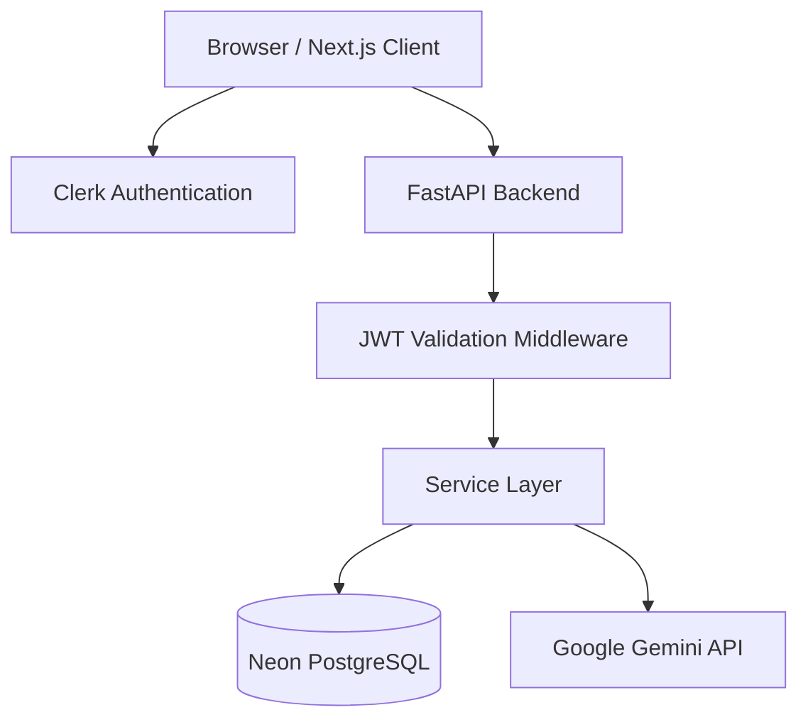

# CopyCraft AI Architecture

This document outlines the architectural decisions and system design of the CopyCraft AI platform.

## High-Level System Architecture

---

## 1. Frontend Architecture (Next.js)
The frontend utilizes the Next.js App Router for optimal SEO and performance.

### Key Technologies
- **React Query**: Handles all server-state caching, synchronization, and automated background updates.
- **Zustand**: Manages local, ephemeral client state (e.g., the complex 7-step Business Wizard progression).
- **Tailwind CSS & shadcn/ui**: Provides a scalable, utility-first design system.
- **Framer Motion**: Delivers premium micro-interactions and route transitions.

### Lazy Loading
Heavy components, such as the `ExplainabilityDashboard` and the Notion-style `DocumentWorkspace`, are dynamically imported (`next/dynamic`) to reduce the initial JavaScript bundle size.

---

## 2. Backend Architecture (FastAPI)
The backend follows a strict Clean Architecture pattern to separate concerns and ensure testability.

### Request Flow
1. **Router (`apps/api/routers/`)**: Defines the REST endpoints and handles HTTP validation.
2. **Middleware (`apps/api/core/`)**: Validates Clerk JWTs and injects security headers (HSTS, CSP).
3. **Service Layer (`apps/api/services/`)**: Contains all business logic, including the Prompt Engine.
4. **Repository Layer (`apps/api/database/`)**: Abstracts SQLAlchemy database operations.

---

## 3. Database Architecture (PostgreSQL)
We utilize Neon Serverless Postgres for connection pooling and scale-to-zero efficiency.

### Schema Highlights
- **Workspace Isolation**: Every table (`Project`, `PromptHistory`, `GeneratedContent`) contains a foreign key to `Workspace`.
- **RBAC**: The `WorkspaceMember` table manages roles (Owner, Editor, Viewer).

---

## 4. The Intelligence Layer
The core value of CopyCraft AI lies in the data transformation pipeline bridging the database and the LLM.

### Context Intelligence Engine
Raw input from the Business Wizard is often unstructured. The Context Engine uses Pydantic to normalize inputs, extract keywords, and format the data into deterministic JSON structures before it reaches the Prompt Builder.

### Explainability Dashboard
A dedicated React component tree (`/explainability`) visualizes this entire internal pipeline, providing recruiters and clients with transparent insight into how the LLM was constrained.

---

## 5. Authentication & Persistence
- **Auth Flow**: The client negotiates a session with Clerk. Clerk issues a JWT. The client attaches this JWT as a Bearer token to FastAPI requests. FastAPI decodes and verifies the signature against Clerk's JWKS endpoint.
- **Persistence Layer**: Data previously held in Zustand is now robustly stored in PostgreSQL. Autosave mechanisms in the frontend use debounced React Query mutations to persist drafts seamlessly.
